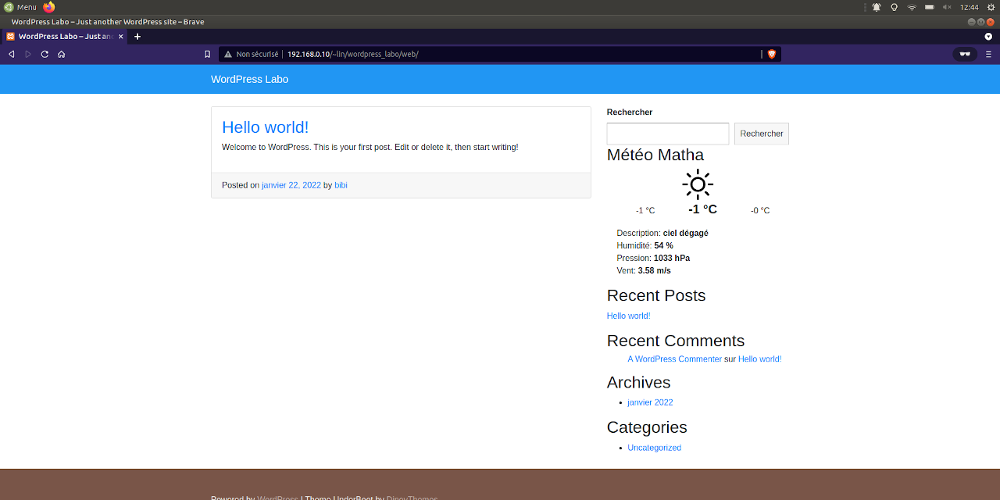

# Widget OpenWeather

Widget WordPress réalisé pour apprendre, celui-ci affiche la météo d'une ville enregistrée.
Il est nécessaire de demander un clé d'api sur le site [OpenWeather](https://openweathermap.org/). La clé est gratuite pour un usage personnel.

## Contributing
[makeareadme](https://www.makeareadme.com/)

## License
[MIT](https://choosealicense.com/licenses/mit/)
